# 麹町弘済ビルディング 2F — 3D間取り再現モデル

オリエントコーポレーション **IT・システムグループ／リスク管理グループ** が入居する
麹町弘済ビルディング 2階（基準階 669.73坪）を、ブラウザで操作できる 3D モデルとして再現したものです。
モバイルPC＋外部モニターで働く約300名のオフィスと、Web会議が日常的に行われる前提で、
席・会議室・Webブース・機器・人物まで1点ずつ実寸で配置しています。
同じモデルを Blender（Cycles）で物理ベースレンダリングし、静止画・360° パノラマと、ブラウザ用の間接光（ライトマップ）を作っています。

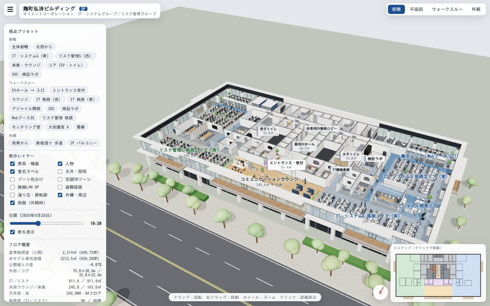

### フォトリアル（Blender Cycles）

| 外観 南東から（10:30） | 外観 夕景（17:18） |
|---|---|
| 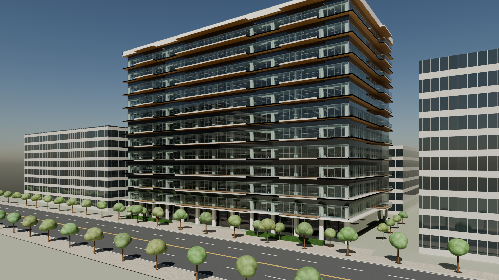 | 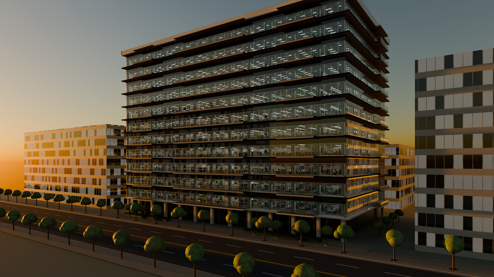 |

| IT・システムG 執務エリア（南） | セキュリティ監視室（SOC/CSIRT） |
|---|---|
| 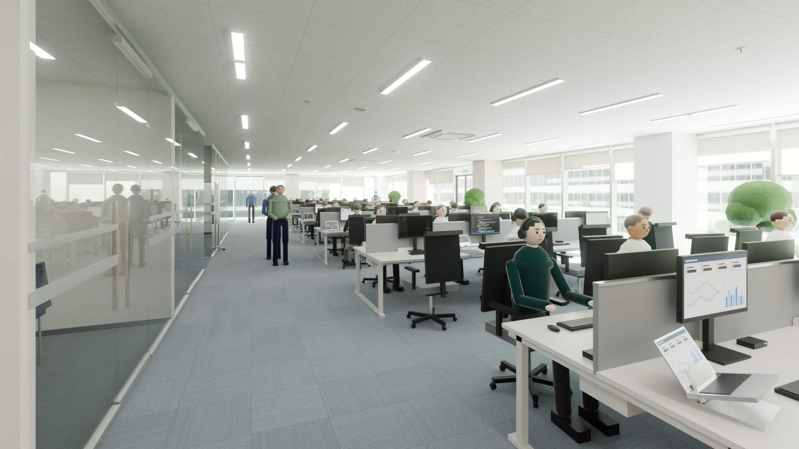 | 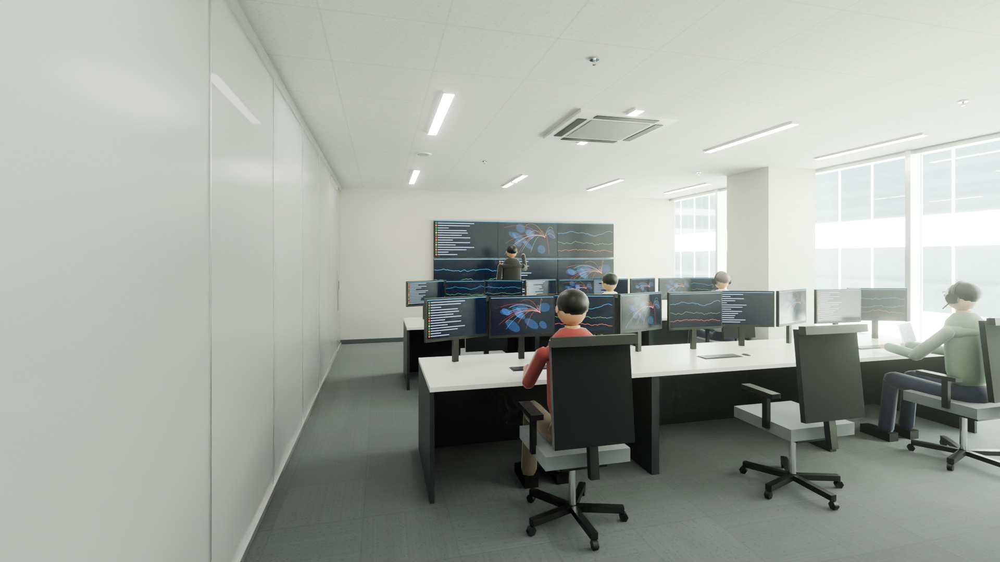 |

| コミュニケーションラウンジ | 全体アクソメ（天井・上階を外して俯瞰） |
|---|---|
| 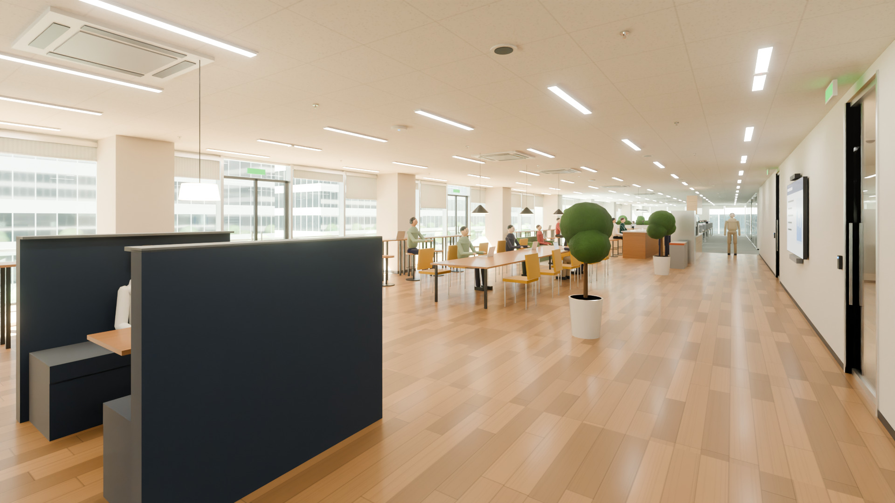 | 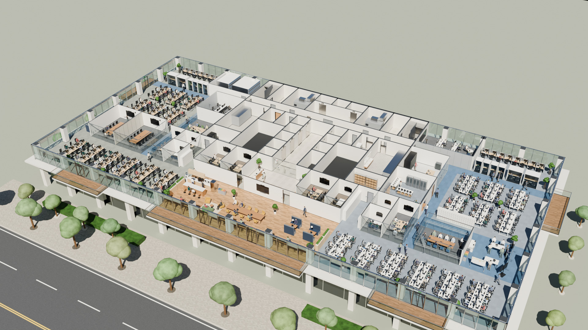 |

静止画 18 枚（1920×1080・160 サンプル）と 360° パノラマ 6 枚（4096×2048・48 サンプル）の原寸は [`docs/renders/`](docs/renders/)、
ビューアでは「フォトリアル（Blender Cycles）」ボタンから一覧・360° 表示を開き、各画像に対応する 3D の視点へ移動できます（360° は撮影位置に立ち、夕景は時刻も合わせる。平面図は除く）。
作り方と照明の校正は [`blender/README.md`](blender/README.md)、ブラウザとの受け渡しの仕様は [`docs/GRAPHICS-PIPELINE.md`](docs/GRAPHICS-PIPELINE.md)。

### ブラウザ版（three.js）

| 平面図 | 分析オーバーレイ（ゾーン・Wi-Fi・避難経路） |
|---|---|
| 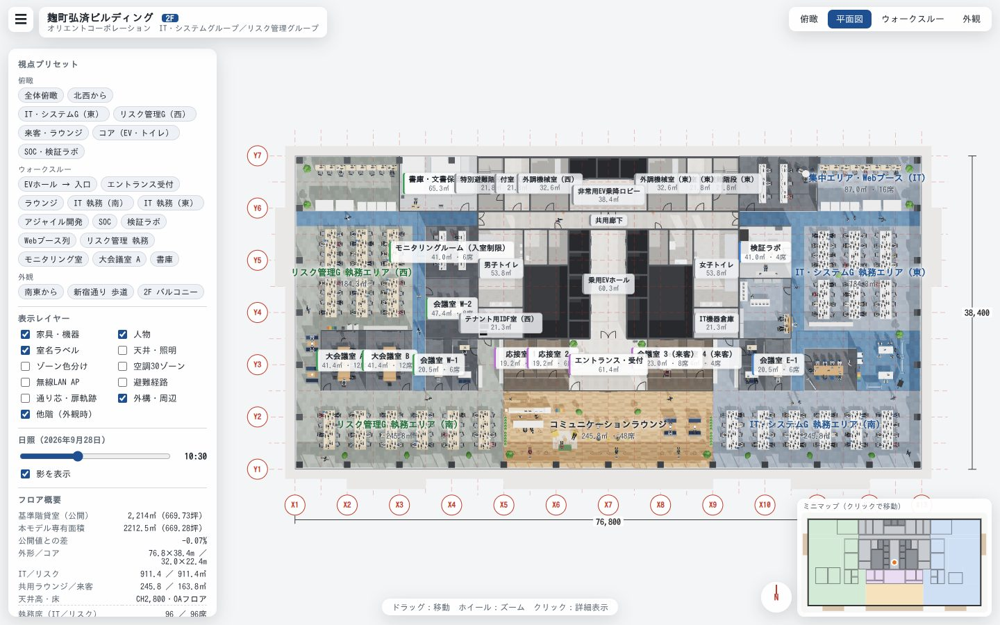 | 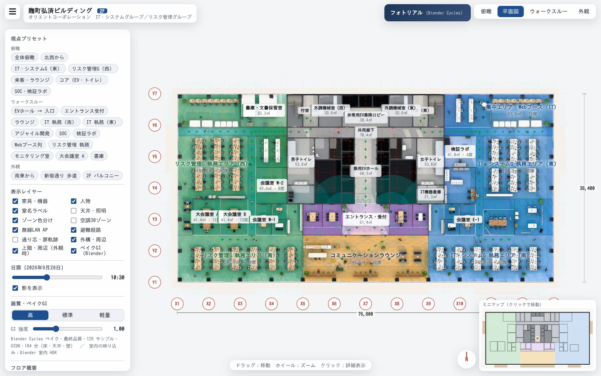 |

| IT 執務エリア（Web会議中の人はヘッドセット） | セキュリティ監視室（SOC/CSIRT） |
|---|---|
| 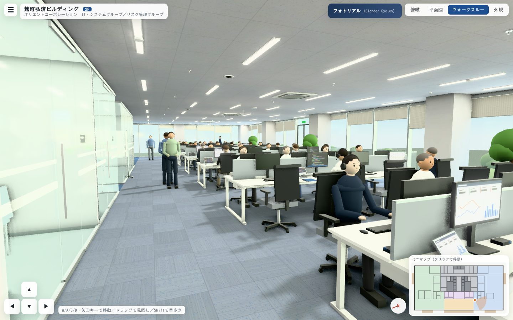 | 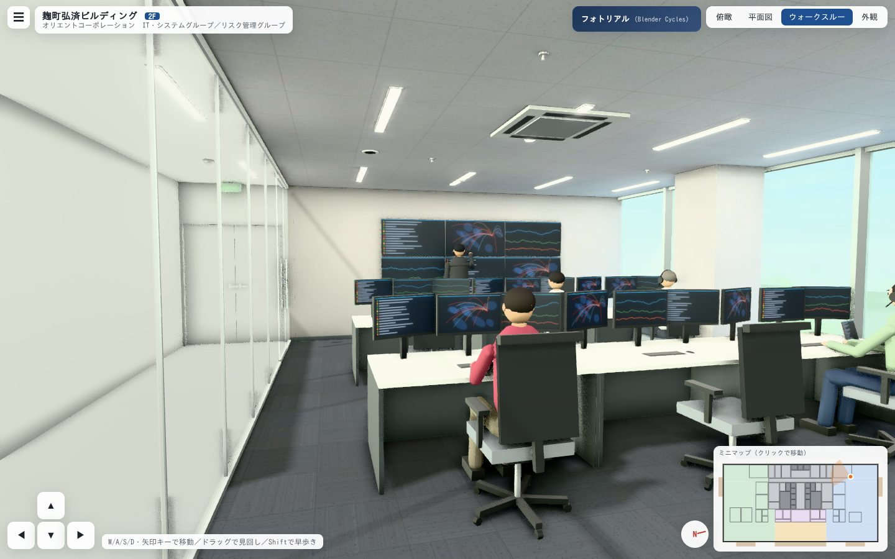 |

| エントランス | ラウンジ |
|---|---|
| 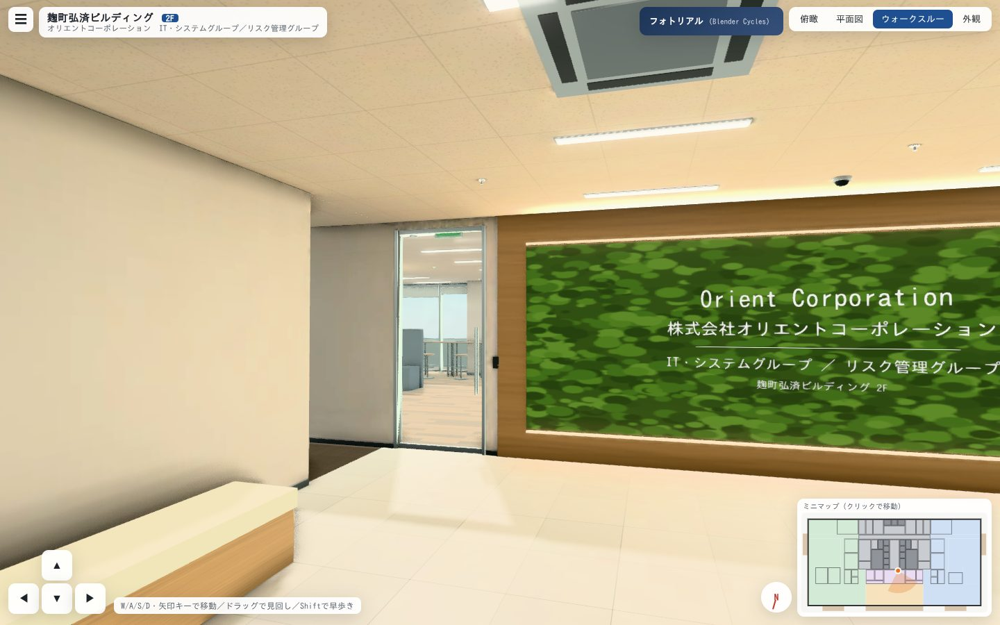 | 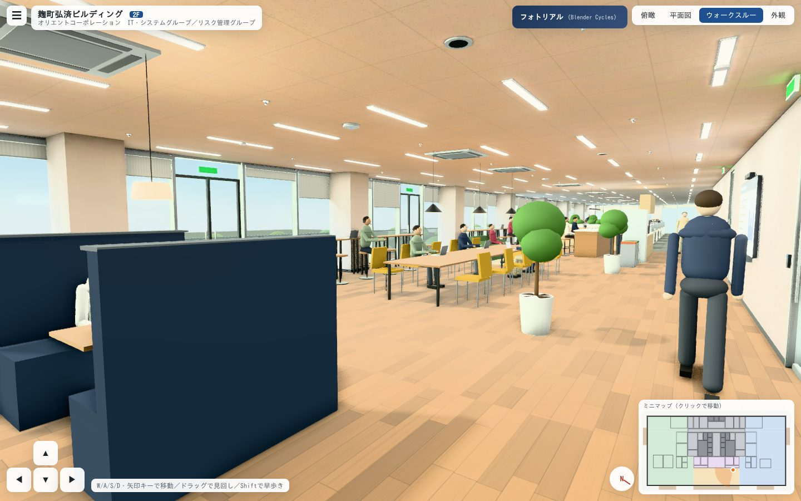 |

| 2F 南面バルコニー | 外観（3〜12F・屋上・周辺街区） |
|---|---|
| 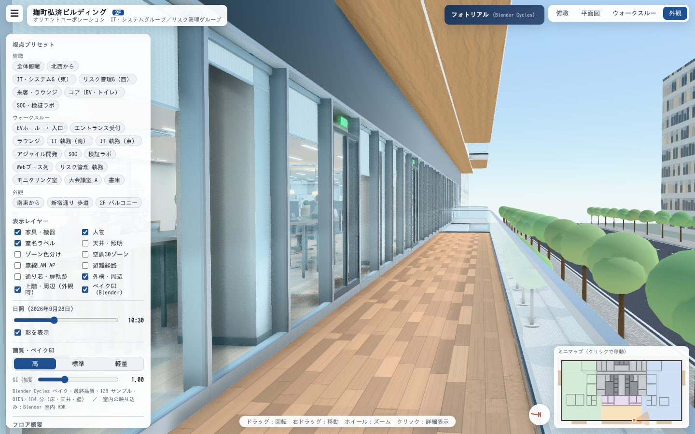 | 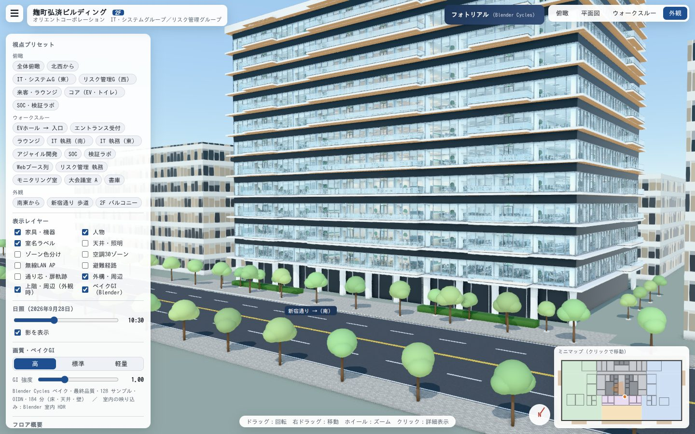 |

---

## 開き方

| 方法 | 手順 |
|---|---|
| **すぐ見る** | [`docs/index.html`](docs/index.html) をダウンロードしてブラウザで開く（three.js・ベイク済みライトマップ・Blender レンダー画像を含む単一 HTML、約 11MB、オフライン可） |
| GitHub Pages | リポジトリ設定で Pages のソースを `docs/` にすると、そのまま公開できます |
| 開発サーバー | `npm install` → `npm run dev` → http://localhost:5173 |
| ビルド | `npm run build`（`dist/`）／`npm run build:standalone`（`dist-standalone/index.html` 単一ファイル） |

WebGL2 対応ブラウザ（Chrome / Edge / Safari / Firefox の最新版）で動作します。スマートフォンでも操作できます（縦画面では平面図を自動回転）。

## 操作

| モード | 操作 |
|---|---|
| 俯瞰 | 左ドラッグ：回転／右ドラッグ：移動／ホイール：ズーム／クリック：席・機器・室の詳細 |
| 平面図 | ドラッグ：移動／ホイール：ズーム。通り芯（X1〜X13・Y1〜Y7）、外形寸法、扉の開き軌跡を表示 |
| ウォークスルー | W/A/S/D・矢印キー：移動、ドラッグ：見回し、Shift：早歩き、ホイール：画角。壁・柱・家具に衝突判定あり。画面の ▲▼◀▶ でも移動可 |
| 外観 | 3〜12F（2F の躯体・天井照明・主な家具を複製）・屋上・塔屋、新宿通り、向かいの麹町ミレニアムガーデン（オリコ本社）など周辺街区を概略表示。建物を遮る街区は自動で隠す |

- **自動ツアー**（画面上部の「▶ ツアー」）：カット割りした視点を自動で巡り、字幕で室名・寸法・面積・席数・設備を表示
  - ハイライト（約 3 分）：外観 → 2F 全体・平面図（ゾーニング・避難経路・無線 LAN）→ エリア俯瞰 → ウォークスルー 13 か所 → 15〜18 時の時間経過
  - 全室めぐり（約 2.5 分）：名前のある全 46 室を 1 室ずつ、床に枠を描いて俯瞰
  - Space：一時停止、←／→：前後のカット、Esc：終了（元の視点・時刻・表示に戻る）。進行バーのクリックで頭出し、1×／1.5×／2× の速度切り替え
  - 「録画して保存」を選ぶと、字幕入りの WebM 動画として保存できる（Chrome・Edge・Firefox）
- **視点プリセット**：23 か所（EVホール、受付、ラウンジ、IT執務、SOC、検証ラボ、Webブース列、モニタリング室、大会議室、書庫、バルコニーなど）
- **表示レイヤー**：家具・人物・室名ラベル・天井設備・ゾーン色分け・空調30ゾーン・無線LAN AP・避難経路・通り芯・外構・上階と周辺（外観時）・ベイクGI
- **フォトリアル**：Blender Cycles の静止画ギャラリーと 360° パノラマビューア。各画像から対応する 3D の視点へ移動できる（360° は撮影位置、時刻もレンダーに合わせる。平面図は除く）
- **画質**：高（MSAA・GTAO 接地陰影・ブルーム・SMAA）／標準／軽量。ベイクGI（Blender で焼いた床・壁・天井の間接光）は時刻に合わせて昼光分を減らす
- **日照**：2026年9月28日の太陽位置（麹町の緯度経度）で時刻を変えられます
- **クリック情報**：席（在席/Web会議中/空席、機器構成）、会議室（寸法・面積・坪・席数・設備・空調ゾーン）、ロッカー、複合機、天井設備など。「この場所を歩いて見る」で室内へ移動
- **ミニマップ**：クリックでその地点へ移動（ウォークスルー時はワープ）
- **画像を保存**（PNG）、**室面積表CSV**（Excel で開ける UTF-8 BOM 付き）

## 再現の考え方 — どこまでが公開情報か

竣工図・テナント内装図は公開されていないため、**公開されている建物仕様に厳密に合わせ、未公開部分は一般的な設計手法で補完**しています。
アプリ内「出典・前提」ボタンでも同じ内容を確認できます。

| 項目 | 本モデル | 根拠 |
|---|---|---|
| 所在地・規模 | 千代田区麹町5-1-4、地上12階・地下2階、高さ62.166m、延床36,361㎡、敷地6,377㎡ | 公開 |
| 竣工・設計・施工 | 2025年6月30日、日建設計、清水建設、事業主 鉄道弘済会 | 公開 |
| 基準階貸室 | **2,214㎡（669.73坪）**。2階も同面積で募集実績あり | 公開 |
| 平面形状 | **コの字型の無柱オフィス**、4分割（157.89／207.12／207.12／97.76坪）可 | 公開 |
| 　→ 寸法化 | 外形 76.8m×38.4m、北側片寄せコア 32.0m×22.4m、3.2mモジュール、外周柱 6.4mスパン・800角 31本 | 推定 |
| 　→ 検証 | **モデル専有面積 2,212.5㎡（669.28坪）＝公開値との差 −0.07%** | 計算 |
| 天井高・床 | CH 2,800（一部2,600）、OAフロア、床荷重 500kg/㎡（EV周り 1,000kg/㎡） | 公開 |
| 空調 | 個別空調・1フロア30ゾーン（ゾーン割付・カセット42台の位置は推定） | 公開＋推定 |
| 外装 | Low-E複層ガラス、庇、木目調のバルコニー（各分割区画に専用バルコニー） | 公開（位置・寸法は推定） |
| 昇降機 | 乗用7基（27人乗）＋非常用・人荷用2基（配置は推定） | 公開＋推定 |
| 給湯室 | 専有部出入口前に給湯室・自販機 | 公開 |
| 立地 | 新宿通り北側の角地、向かいに麹町ミレニアムガーデン（オリコ本社） | 公開（周辺形状は概略） |
| テナント内装 | 室の用途・名称・家具・人員配置 | **想定** |

### テナント内装の想定

- 在籍 約300名（IT・システムG 約170名／リスク管理G 約130名）、出社率 約65%。グループアドレス＋ABW。
- **モバイルPC前提**：全執務席に24型モニター＋USB-Cドック＋キーボード/マウス、ロッカーはPC充電コンセント付き（360人分）、ITサポートデスクでキッティング・貸出、ノートPC充電保管庫。
- **リモート会議が活発**：全会議室にディスプレイ＋カメラバー（大会議室は話者追尾カメラ＋天井アレイマイク）、1人用Webブース8台・2人用4台、Web会議室4室、ハイバックソファブース。無線LAN APは約90㎡/台（24台）の高密度配置。表示中の在席者のうち約2割がヘッドセットでWeb会議中。
- **IT・システムG**：SOC/CSIRT（生体認証＋ICカード、すりガラス）、検証ラボ（42Uラック×5、スマホ実機検証）、プロジェクトルーム、アジャイル開発エリア。
- **リスク管理G**：入室制限のモニタリングルーム、書庫（電動移動棚8連）、可動間仕切りで24名になる大会議室。
- 組織名で公開情報から確認できたのは「IT・システムグループ（IT・システム企画部、サイバーセキュリティ室など）」「リスク管理グループ（信用管理部など）」まで。社名は文字のみで表記し、ロゴは使っていません。

## 主な数値（モデルから自動集計）

| 項目 | 値 |
|---|---|
| 執務席 | IT 96席／リスク 96席（ほか集中席16、SOC・モニタリング卓12、サポート2） |
| 会議室・Web会議室 | 14室・88席（ほかWebブース 1人用8／2人用4、ラウンジ約43席） |
| 個人ロッカー | 360人分 |
| 表示中の人物 | 約250人（うちWeb会議中 約50人、歩行者11人はアニメーション） |
| モバイルPC／外部モニター | 約200台／約240台 |
| 天井設備 | LEDライン照明374、ダウンライト120、空調カセット42、無線AP24、スプリンクラー158、感知器52、スピーカー41、監視カメラ11 |
| カーテンウォール | 124スパン（マリオン1.6mピッチ）、バルコニー5か所 |

## 室一覧（面積は壁芯）

#### IT・システムグループ（計 911.4㎡）

| 室名 | 寸法 | 面積 | 席数 | 主な設備 |
|---|---|---:|---:|---|
| セキュリティ監視室（SOC/CSIRT） | 9.6×6.8m | 65.3㎡ | 6 | 55型×6面 ビデオウォール、監視卓 6席（トリプルモニター）、インシデント対応テーブル、入室記録カメラ |
| 集中エリア・Webブース（IT） | 12.8×6.8m | 87.0㎡ | 16 | 集中席（サイドパネル付）×8、1人用Webブース ×4、2人用Webブース ×2 |
| 検証ラボ | 6.4×6.4m | 41.0㎡ | 4 | 42Uラック ×5（検証環境）、作業台（静電対策）、スマートフォン検証端末キャビネット、帯電防止床 |
| ITサポートデスク・キッティング | 6.4×7.4m | 47.4㎡ | 4 | ヘルプデスク窓口カウンター、キッティング作業台 ×2、ノートPC充電保管庫 ×3、貸出用モバイルPC・Webカメラ・ヘッドセット |
| IT・システムG 執務エリア（東） | 14.4×12.8m | 184.3㎡ | 48 | ベンチデスク 8人島 ×6（W1200×D700/席、中央スクリーンH400）、各席 24型モニター＋USB-Cドック（モバイルPC接続）、グループアドレス運用 |
| プロジェクトルーム | 6.4×5.2m | 33.3㎡ | 10 | 75型ディスプレイ、Web会議カメラバー、ホワイトボード壁、天井マイク |
| アジャイル開発エリア | 8.0×7.4m | 59.2㎡ | 12 | スタンディングテーブル ×2、モバイルホワイトボード ×3、カンバンボード、モバイルディスプレイ |
| Web会議室 E-1 | 3.2×3.2m | 10.2㎡ | 2 | 43型ディスプレイ、Webカメラ、吸音パネル |
| Web会議室 E-2 | 3.2×3.2m | 10.2㎡ | 3 | 43型ディスプレイ、Webカメラ、吸音パネル |
| 会議室 E-1 | 3.2×6.4m | 20.5㎡ | 6 | 65型ディスプレイ、Web会議カメラバー |
| ロッカーコーナー（IT） | 3.2×6.4m | 20.5㎡ |  | 個人ロッカー（電子錠・PC充電コンセント付） |
| IT・システムG 執務エリア（南） | 25.6×9.6m | 245.8㎡ | 48 | ベンチデスク 8人島 ×6（南面窓に直交配置）、各席 24型モニター＋USB-Cドック、南東バルコニー出入口 |

#### リスク管理グループ（計 911.4㎡）

| 室名 | 寸法 | 面積 | 席数 | 主な設備 |
|---|---|---:|---:|---|
| 書庫・文書保管室 | 9.6×6.8m | 65.3㎡ |  | 電動式移動棚（集密書架）、業務用シュレッダー、スキャナー（電子化作業台） |
| 集中エリア・Webブース（リスク） | 12.8×6.8m | 87.0㎡ | 16 | 集中席（サイドパネル付）×8、1人用Webブース ×4、2人用Webブース ×2 |
| モニタリングルーム（入室制限） | 6.4×6.4m | 41.0㎡ | 6 | 監視卓 6席（デュアルモニター）、55型×4面 モニターウォール、不正検知ダッシュボード |
| 会議室 W-2 | 6.4×7.4m | 47.4㎡ | 8 | 65型ディスプレイ、Web会議カメラバー、天井マイク |
| リスク管理G 執務エリア（西） | 14.4×12.8m | 184.3㎡ | 48 | ベンチデスク 8人島 ×6（木目天板）、各席 24型モニター＋USB-Cドック、複合機コーナー・個人ロッカー |
| 大会議室 A | 5.6×7.4m | 41.4㎡ | 12 | 86型ディスプレイ、Web会議カメラ（話者追尾）、天井アレイマイク、可動間仕切りでB室と一体利用（24名） |
| 大会議室 B | 5.6×7.4m | 41.4㎡ | 12 | 86型ディスプレイ、Web会議カメラ（話者追尾）、天井アレイマイク |
| ペリメーターブース | 3.2×7.4m | 23.7㎡ | 4 | 2人用ハイバックブース ×2 |
| Web会議室 W-1 | 3.2×3.2m | 10.2㎡ | 2 | 43型ディスプレイ、Webカメラ、吸音パネル |
| Web会議室 W-2 | 3.2×3.2m | 10.2㎡ | 3 | 43型ディスプレイ、Webカメラ、吸音パネル |
| 会議室 W-1 | 3.2×6.4m | 20.5㎡ | 6 | 65型ディスプレイ、Web会議カメラバー |
| ロッカーコーナー（リスク） | 3.2×6.4m | 20.5㎡ |  | 個人ロッカー（電子錠・PC充電コンセント付） |
| リスク管理G 執務エリア（南） | 25.6×9.6m | 245.8㎡ | 48 | ベンチデスク 8人島 ×6（南面窓に直交配置）、各席 24型モニター＋USB-Cドック、南西バルコニー出入口 |

#### 共用（ラウンジ）（計 245.8㎡）

| 室名 | 寸法 | 面積 | 席数 | 主な設備 |
|---|---|---:|---:|---|
| コミュニケーションラウンジ | 25.6×9.6m | 245.8㎡ | 48 | パントリー（コーヒーマシン・冷蔵庫・電子レンジ・ウォーターサーバー）、98型ディスプレイ（全体会議・ハイブリッド配信）、ハイバックソファブース（Web会議可）、窓際カウンター、南面バルコニー出入口 |

#### 来客ゾーン（計 163.8㎡）

| 室名 | 寸法 | 面積 | 席数 | 主な設備 |
|---|---|---:|---:|---|
| エントランス・受付 | 9.6×6.4m | 61.4㎡ |  | 無人受付（内線電話・受付タブレット）、サインウォール、共連れ防止カードリーダー、監視カメラ |
| 応接室 1 | 4.0×4.8m | 19.2㎡ | 6 | 65型ディスプレイ、Web会議カメラバー、天井マイク |
| 応接室 2 | 4.0×4.8m | 19.2㎡ | 6 | 65型ディスプレイ、Web会議カメラバー |
| 来客通路（西） | 8.0×1.6m | 12.8㎡ |  |  |
| 会議室 3（来客） | 4.8×4.8m | 23.0㎡ | 8 | 75型ディスプレイ、Web会議カメラバー、天井マイク |
| Web会議室 4（来客） | 3.2×4.8m | 15.4㎡ | 4 | 55型ディスプレイ、Web会議カメラバー |
| 来客通路（東） | 8.0×1.6m | 12.8㎡ |  |  |

#### 共用部（コア）（計 716.8㎡）

| 室名 | 寸法 | 面積 | 席数 | 主な設備 |
|---|---|---:|---:|---|
| 特別避難階段（西） | 3.2×6.8m | 21.8㎡ |  |  |
| 付室（西） | 3.2×6.8m | 21.8㎡ |  |  |
| 外調機械室（西） | 4.8×6.8m | 32.6㎡ |  | 外気処理空調機（全熱交換器）、ダクトシャフト |
| 非常用EV乗降ロビー | 9.6×4.0m | 38.4㎡ |  |  |
| 外調機械室（東） | 4.8×6.8m | 32.6㎡ |  | 外気処理空調機（全熱交換器）、ダクトシャフト |
| 付室（東） | 3.2×6.8m | 21.8㎡ |  |  |
| 特別避難階段（東） | 3.2×6.8m | 21.8㎡ |  |  |
| 共用廊下 | 32.0×2.2m | 70.4㎡ |  |  |
| 乗用EVホール | 4.5×13.4m | 60.3㎡ |  | 乗用EV 7基（27人乗）、インジケーター・ホールランタン、AED・消火器 |
| 男子トイレ | 5.6×9.6m | 53.8㎡ |  | 小便器 ×5、大便器ブース ×4、3連洗面カウンター（自動水栓） |
| 多目的トイレ | 3.0×4.4m | 13.2㎡ |  | オストメイト対応、ベビーシート、手すり |
| テナント用IDF室（西） | 5.6×3.8m | 21.3㎡ |  | フロアスイッチ（PoE）、パッチパネル、UPS |
| 女子トイレ | 5.6×9.6m | 53.8㎡ |  | 大便器ブース ×7、3連洗面カウンター ×2（うち1台はパウダーコーナー） |
| 共用給湯室 | 3.0×4.4m | 13.2㎡ |  | 流し台、電気温水器、自動販売機 |
| IT機器倉庫 | 5.6×3.8m | 21.3㎡ |  | スチールラック、交換用PC・周辺機器、廃棄PC保管（データ消去待ち） |

## 実図面で精度を上げるには

すべての寸法はデータとして分離してあるので、図面が入手できれば座標を差し替えるだけで反映されます。

| ファイル | 内容 |
|---|---|
| `src/data/spec.ts` | 外形・コア・階高・柱・マリオンピッチなど建物寸法（公開／推定の区別をコメントで明記） |
| `src/data/rooms.ts` | 全69室の矩形・壁種（RC／LGS／ガラス／すりガラス／可動間仕切り）・扉（種類・位置・開き勝手・カードリーダー）・席数・設備 |
| `src/build/layout.ts` | 家具・機器・人物の配置（デスク島、会議卓、ブース、ロッカー、SOC卓など） |
| `src/build/ceiling.ts` | 照明・空調・AP・防災設備の配置ルール（壁との干渉を自動回避）と空調30ゾーン |

座標系は x=東、z=南、y=上（単位 m）、原点は 2F プレート中心・OA 床仕上げ面です。
壁は室の辺の指定から自動生成され、同一線上の重複は壁種の優先度で統合、扉位置は開口として自動で切り欠かれます。

## 技術構成

- three.js（WebGL2）＋ TypeScript ＋ Vite。床材・画面・サイン等のテクスチャは Canvas で手続き生成（ライトマップ・HDR・レンダー画像は Blender の出力）
- 家具・人物は約120種のプロトタイプをマテリアル単位でマージした InstancedMesh で描画（数千点を数百ドローコールに集約）
- 太陽位置は NOAA 簡易式、影は日照変更時のみ再計算。外観は Sky シェーダの空と、それから作る環境マップ
- ポストエフェクト：EffectComposer（MSAA・GTAO・発光体だけの選択的ブルーム・Neutral トーンマッピング・SMAA）
- Blender 連携：ブラウザのシーンを glTF（EXT_mesh_gpu_instancing）で書き出し、PyPI の `bpy`（Blender 4.5 LTS）で
  Cycles のライトマップ（床・天井・壁 4096 px・128 サンプル）・室内 HDR・静止画・360° パノラマを生成。ライトマップ用 UV はブラウザ側で決定論的に作り、レイアウトのハッシュで照合
- `vite-plugin-singlefile` で three.js・ライトマップ・レンダー画像ごと単一 HTML に同梱

## 出典（公開情報）

- 公益財団法人 鉄道弘済会「新築オフィスビル『麹町弘済ビルディング』が竣工しました。」 https://www.kousaikai.or.jp/2025/08/08/16606/
- CBRE 麹町弘済ビルディング https://www.cbre.co.jp/properties/office/p-113101166011/s-2157517
- 三菱地所リアルエステートサービス 麹町弘済ビルディング https://office.mecyes.co.jp/office/detail/13/13101/a251000000BEUBxAAP
- 東京ベストオフィス 麹町弘済ビルディング 2階（669.73坪） https://best-tokyo.com/office/items/19090/00042799
- オフィスター スタログ「麹町弘済ビルディング」 https://www.officetar.jp/blog/2024/06/24/koujimachi-kousai-building/
- SOHOオフィスナビ 麹町弘済ビルディング https://sohonavi.jp/building/detail_20272/
- 千代田区 建築物環境計画書（(仮称)弘済会館ビル新築工事） https://www.city.chiyoda.lg.jp/documents/28052/r404kankyokeikakusho-1_1.pdf
- 超高層ビルディング 麹町弘済ビルディング https://skyskysky.net/construction/202570.html
- オリエントコーポレーション 本社組織 https://www.orico.co.jp/company/corporate/about/organization/

## 注意

本モデルは公開情報に基づく**参考再現**であり、実際の内装・セキュリティ設備・人員配置を示すものではありません。
